# omijobs

Deterministic, programmatic job retrieval from job boards and aggregator portals.
Local-first: no browser automation, no AI in the retrieval loop. Every sweep is driven
by a plain config file and produces reproducible output you can diff between runs.

**Start with the dashboard.** Everything you'll do in a normal day — run sweeps, triage
results, tweak searches, schedule, and (optionally) let AI score them — happens in one
local web app. The full config reference is [config.guide.md](config.guide.md).

## Requirements

- **Node ≥ 24** (uses the built-in `node:sqlite`)

## Install

```bash
npm install -g omijobs
```

That's it. `omijobs` is on your PATH, and your settings live in `~/.omijobs/`.

## Start here: the dashboard

```bash
omijobs dashboard
```

This starts the dashboard at **http://127.0.0.1:5211** and opens it in your browser
(use `omijobs dashboard --port 5212` if the port is taken). The first launch seeds a
default config into `~/.omijobs/` — an existing config is never overwritten.

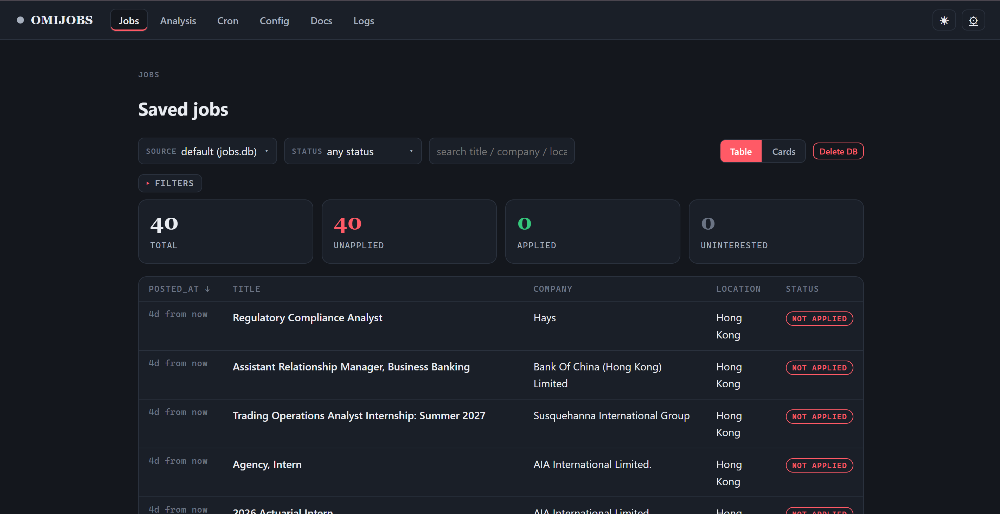

The dashboard has six tabs:

| Tab | What it's for |
|---|---|
| **Jobs** | See everything found so far; filter with facets; mark jobs applied / not interested |
| **Analysis** | (Optional) AI scoring of job descriptions via any OpenAI-compatible provider |
| **Cron** | Schedule sweeps with human-friendly schedules |
| **Config** | Edit your searches and per-portal settings |
| **Docs** | In-app reference |
| **Logs** | Live run output and history |

### Browse and triage results

The **Jobs** tab is where everything lands. Results show as a compact table by
default; switch to **Cards** for a fuller read, and use the **Filters** drawer to
narrow by status, portal, posted date, or any extracted field.

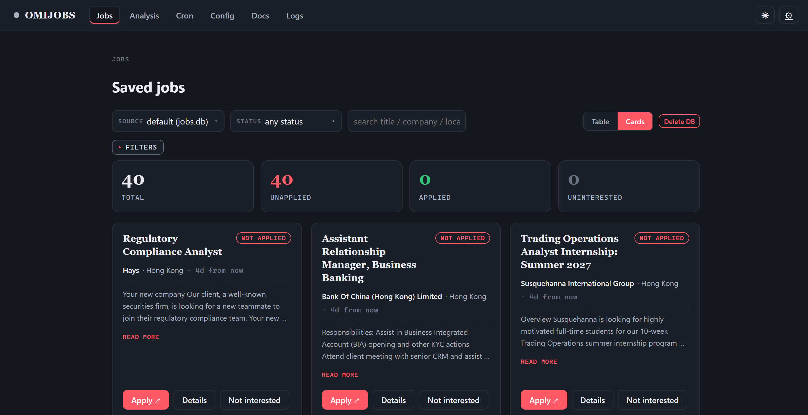

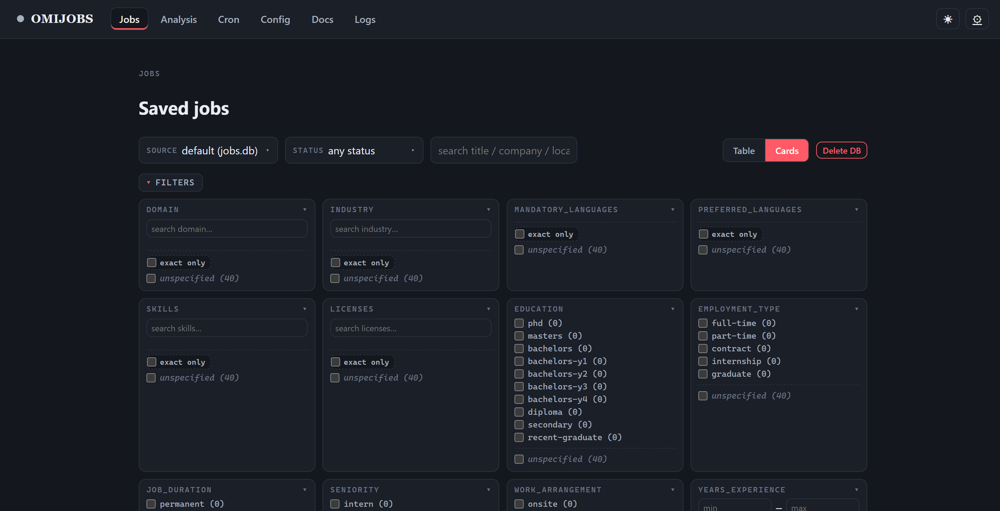

### Your first sweep — under a minute

1. **Start the dashboard** — `omijobs dashboard`
2. **Set your search terms** — open the **Config** tab, put your terms in
   `global.queries`, and save. Each query runs against every enabled portal, and results
   deduplicate across all queries × portals.
3. **Run it** — back on the **Jobs** tab, hit **Run**. Results stream in as each portal
   is swept; if nothing comes back, try broader terms.
4. **Triage** — open any job for its apply link; use the status dropdown to mark it
   *applied* or *not interested*.

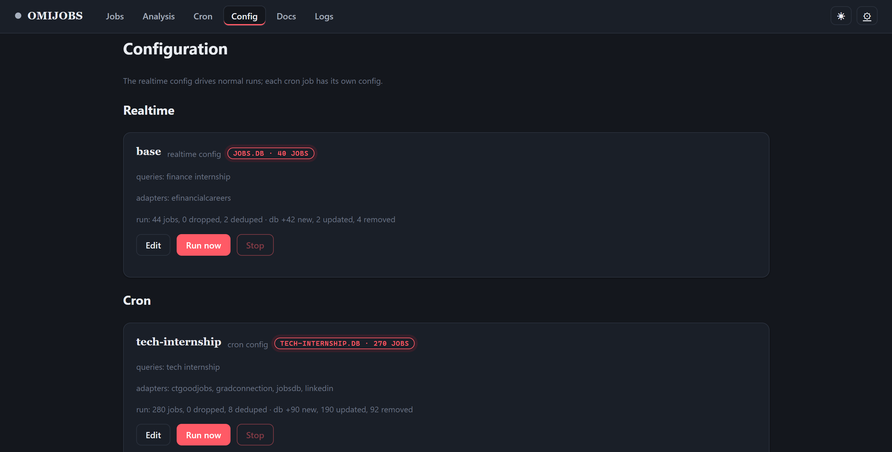

Every run is also written to `output/runs/<timestamp>/` (path controlled by
`outputDir` in your config): `jobs.json` is the deduped, normalized job list and
`run.json` is the record of the run — queries, per-portal status and counts, what got
dropped or deduplicated, timings.

## Scheduling sweeps

Open the **Cron** tab, pick a config, give it a schedule — done. Schedules are
human-friendly: `every 30m`, `every 6 hours`, `daily at 09:00`, `weekdays at 18:30`,
`monday at 09:00`. The gateway auto-starts at login and survives reboots.

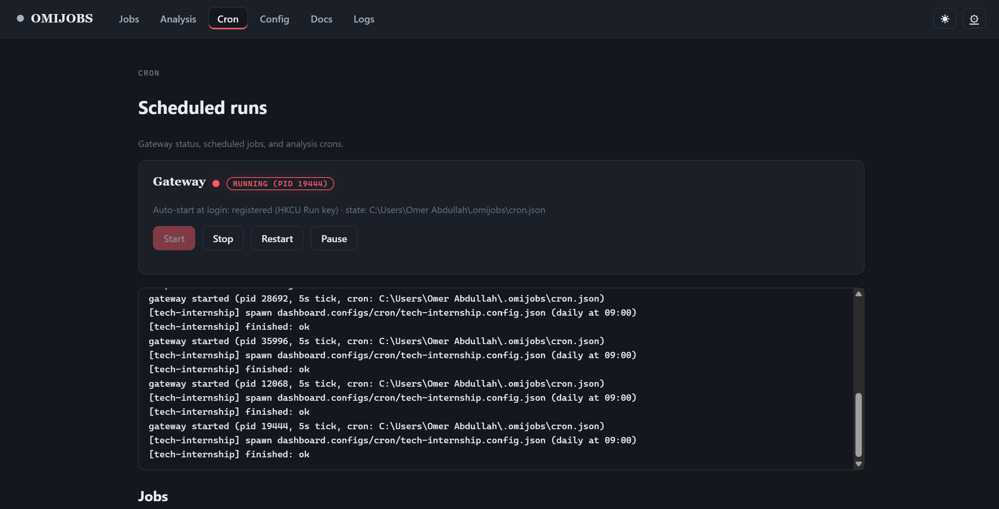

Each job card shows its schedule, queries, database, and last run; analysis jobs
appear in their own section.

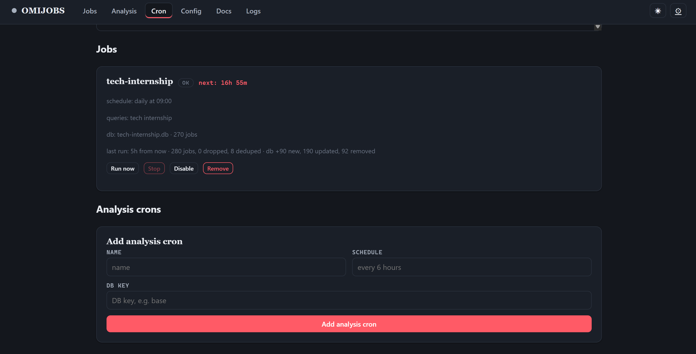

Add a new job (or an analysis cron) straight from the tab.

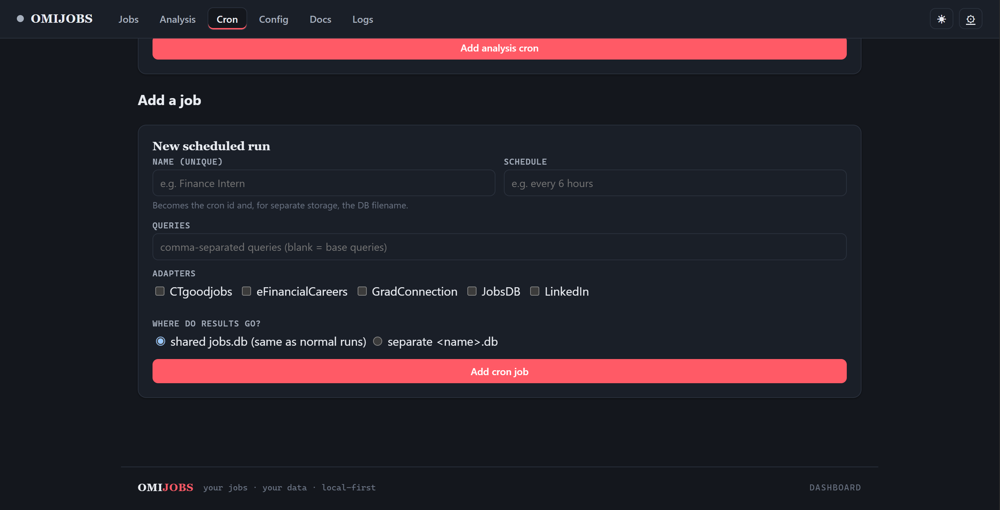

A scheduled run is identical to a manual one except its `run.json` carries
`"trigger": "cron"`, so scheduled results are easy to separate.

## Optional: AI analysis

The **Analysis** tab scores rows in your database through any OpenAI-compatible
provider. Settings are seeded from `analysis.config.base.json` into
`~/.omijobs/analysis.json`; API keys are write-only and resolve from the process
environment. The model extracts a structured profile from each job description — skills,
languages, seniority, salary, and more — stored per row and surfaced as filters in the
Jobs tab.

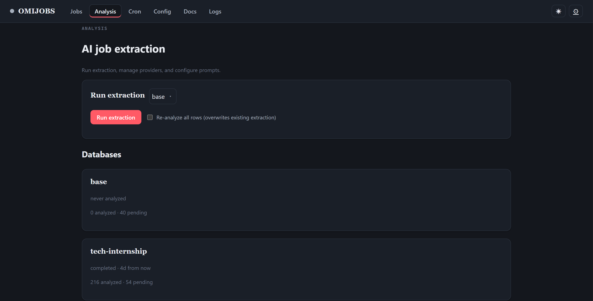

Providers and extraction settings live below — add any OpenAI-compatible provider,
then tune the prompt and request size.

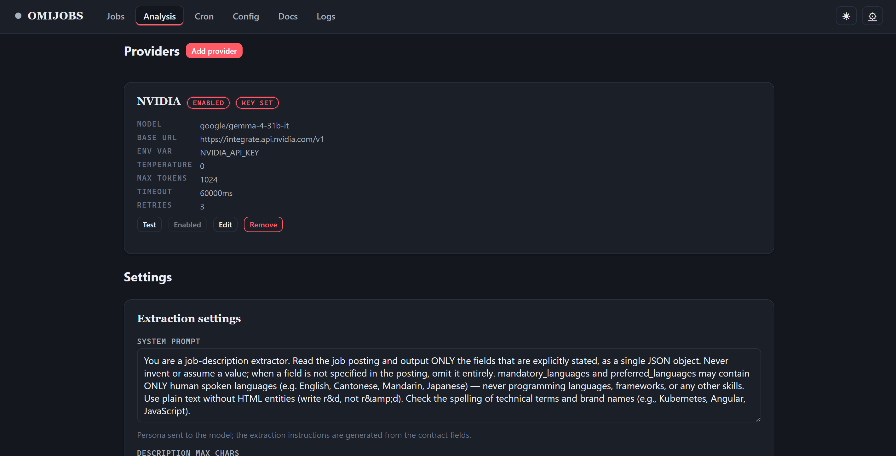

## The other tabs

**Docs** is an in-app copy of this guide; **Logs** tails run output live and keeps
history; **Settings** shows where config and state live on disk.

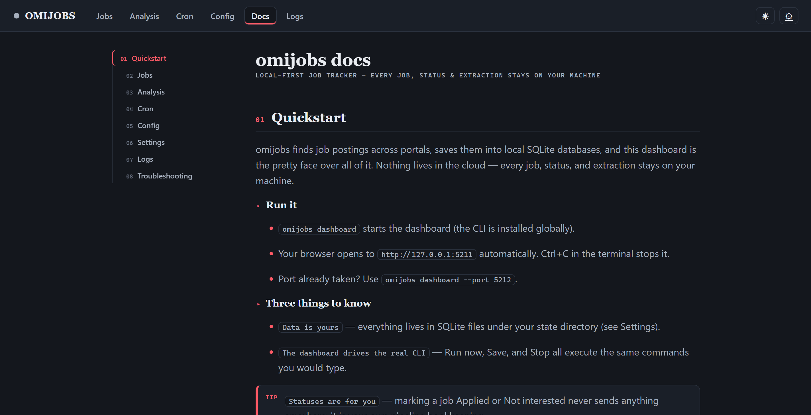

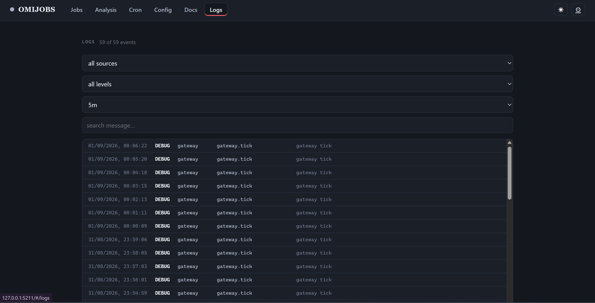

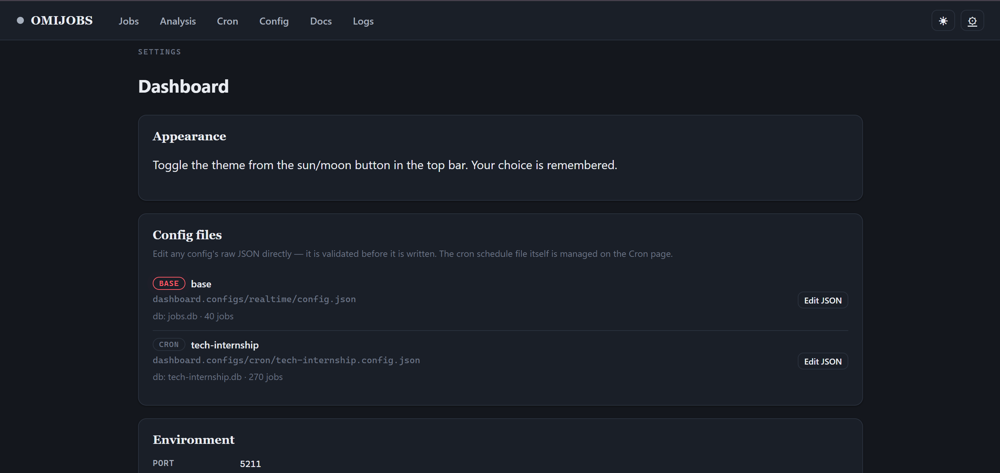

## The CLI

The dashboard drives the same engine the CLI does. Use the CLI when you want sweeps in
a script, a terminal, or a cron job of your own:

```bash
omijobs run                  # sweep every enabled portal now (default command)
omijobs cron add --config <path> --schedule "<str>"
omijobs cron start           # background gateway + auto-start at login
omijobs analyze base         # AI-score the database (needs a configured provider)
omijobs db list              # inspect the aggregate database
omijobs logs                 # tail logs
```

Bare `omijobs` runs a sweep. `--config <path>` points at any config; the default is
`~/.omijobs/dashboard.configs/realtime/config.json`.

### Exit codes

`0` = at least one portal found jobs; `1` = nothing found (or a run failed). A run that
returns nothing on purpose (e.g. an empty `portals.enabled`) exits `1` — treat it as
"nothing new".

## Config at a glance

Everything about a run lives in `config.json` — there are no per-run query flags:

- `global.queries` — the search terms (required)
- `portals.enabled` / `ats.enabled` — which adapters run (ATS backends are a future
  named-employer mode; v1 ships portals only)
- `portals.config.<id>` — per-portal search params and pacing
- `outputs.required` / `dedup.fields` / `outputDir` — drop policy, dedup signature,
  output location
- `db` — the aggregate store (on by default, 30-day retention; disable it in Config if
  you don't want it)

### Geography gotchas

Portals are geographically scoped — `location` *narrows* within a portal's scope, it never
changes the scope:

- **ctgoodjobs** — Hong Kong only; `location` is ignored
- **gradconnection** / **jobsdb** — HK by default (gradconnection's `country`, jobsdb's
  `siteKey`)
- **efinancialcareers** — country-scoped by `countryCode2` (sent as the search `location` when unset)
- **linkedin** — the only global portal; set `location` to scope it

### Environment variables

No secrets in config.json. Adapters read env vars for anything sensitive:

| Var | Portal | Effect |
|---|---|---|
| `JD_UA` / `LI_UA` / `EF_UA` | jobsdb+ctgoodjobs / linkedin / efinancialcareers | Custom browser User-Agent (defaults to a bundled Chrome UA) |

## Commands

```
omijobs run [--config <path>]   Run a job sweep now (default when no command given)
omijobs cron <command>          Manage scheduled runs and the gateway

  cron add --config <path> --schedule "<str>" [--name <id>]
  cron list | enable <id> | disable <id> | remove <id>
  cron pause | resume
  cron start | stop | restart | status
  cron run                      Run every enabled job now, ignoring schedules

Any command accepts --help.
```
