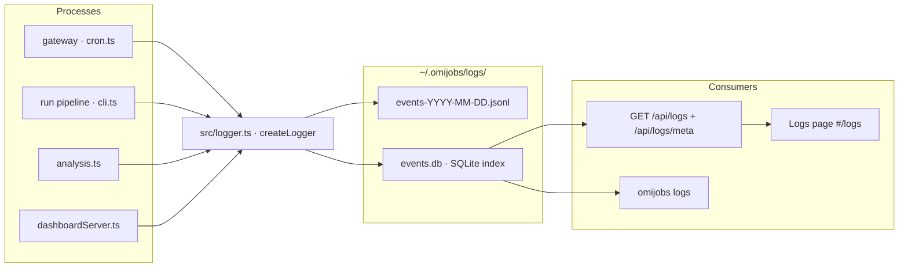

# Structured Logging — Design

**Goal:** Replace the scattered flat-text log files (`cron.log`, `runs/<id>.log`, `analysis/<db>.log`) with a single structured, queryable event log that every process (gateway, run pipeline, analysis, dashboard) writes to. Expose it through a dedicated dashboard page and a dedicated `omijobs logs` CLI subcommand so the user can see exactly what happened, what went wrong, what crashed, when, what was triggered/stopped, how much each thing did, and the exact error that caused any stoppage.

**Date:** 2026-08-26 · **Status:** Design (approved 2026-08-26)

---

## 1. Terminology

| Term | Meaning |
|---|---|
| **Event** | One structured log record (one JSON line), with `ts`, `level`, `source`, `event`, correlation ids, a human `message`, and optional structured `data`. |
| **JSONL** | The append-only, human-greppable log-of-record: one file per day, `events-YYYY-MM-DD.jsonl`, one JSON object per line. |
| **Index DB** | A SQLite DB (`events.db`) mirroring the JSONL, used for fast filtered queries and the dashboard/CLI. |
| **Source** | Which process emitted the event: `gateway | run | analysis | dashboard`. |
| **Level** | `debug | info | warn | error`. |
| **Correlation ids** | `runId` (one sweep/analysis pass) and `jobId` (cron config slug) carried on every event so one run's full trace can be reconstructed. |
| **Emitter** | `src/logger.ts` — the single write path used by all four processes. |

---

## 2. Architecture

### 2.1 One emitter, two stores



- **JSONL is the log-of-record** — append-only, one file per day, human-greppable, replayable. A crashed process still leaves a readable file.
- **SQLite (`events.db`) is the query index** — the same events, in WAL mode with `busy_timeout = 5000`, for fast filtered reads by the dashboard and CLI.
- Every process goes through the **same emitter** (`src/logger.ts`), so event shape and retention are uniform everywhere.

### 2.2 Event schema

One JSON object per line, always in this shape:

```json
{
  "ts": "2026-01-15T10:30:00.123Z",
  "level": "error",
  "source": "analysis",
  "event": "analysis.job.failed",
  "runId": "2026-01-15T10-00-00-000Z",
  "jobId": "finance",
  "pid": 4312,
  "message": "provider call failed: timeout after 60000ms",
  "data": { "error": "TimeoutError", "stack": "…", "attempt": 2, "retries": 3 }
}
```

| Field | Type | Notes |
|---|---|---|
| `ts` | ISO-8601 UTC string | Millisecond precision; the sort key. |
| `level` | `debug\|info\|warn\|error` | Severity. |
| `source` | `gateway\|run\|analysis\|dashboard` | Emitting process. |
| `event` | dot-namespaced string | E.g. `gateway.started`, `run.adapter.done`, `analysis.job.failed`, `dashboard.stop`. |
| `runId` | string \| null | The run/analysis id when in one; `null` for gateway/dashboard meta events. |
| `jobId` | string \| null | Cron config slug when in one; `null` otherwise. |
| `pid` | number | `process.pid` of the emitter. |
| `message` | string | One-line human summary. |
| `data` | object \| null | Structured payload: error name + stack, counts, durations, attempt numbers. |

`data` values are stored as a JSON string column in SQLite (not parsed into typed columns); the query layer does not need to interpret arbitrary payloads.

### 2.3 Event taxonomy (the dot-namespaced `event` values)

| Source | `event` | Level | When |
|---|---|---|---|
| gateway | `gateway.started` | info | Gateway boots, pid + schedule count. |
| gateway | `gateway.stopped` | info | Gateway exits cleanly. |
| gateway | `gateway.tick` | debug | Each 5s tick (rate-limited, see §4.4). |
| gateway | `gateway.paused` / `gateway.resumed` | info | Pause toggle. |
| gateway | `job.due` | debug | A cron job became due. |
| gateway | `job.spawned` | info | A due job process was spawned. |
| gateway | `job.spawn_failed` | error | Spawn errored (with the underlying error). |
| gateway | `job.finished` | info | A spawned job exited (with exit code + duration). |
| run | `run.started` | info | Pipeline begins (config, adapters, queries). |
| run | `run.adapter.start` | info | An adapter begins a query. |
| run | `run.adapter.done` | info | An adapter finishes (status + job count). |
| run | `run.progress` | info | Live `N/M` progress. |
| run | `run.finished` | info | Pipeline completes (full `RunSummary` counts in `data`). |
| run | `run.stopped` | warn | Stop marker observed; partial results saved. |
| run | `run.error` | error | Fatal pipeline error (with stack). |
| analysis | `analysis.started` | info | Pass begins (db, provider, instructions). |
| analysis | `analysis.job.evaluating` | debug | About to call the provider for a job. |
| analysis | `analysis.job.skipped` | debug | Row already analyzed. |
| analysis | `analysis.job.deleted` | debug | Row deleted by retention. |
| analysis | `analysis.job.analyzed` | info | Verdict stored (score). |
| analysis | `analysis.job.failed` | warn | Provider failed after retries; row left empty. |
| analysis | `analysis.provider.call` | debug | Provider HTTP call started (attempt #). |
| analysis | `analysis.provider.retry` | warn | Transient error; retrying (attempt #, `Retry-After`). |
| analysis | `analysis.provider.fail` | error | Auth/config error → run aborts (the exact reason). |
| analysis | `analysis.finished` | info | Pass completes (counts). |
| analysis | `analysis.stopped` | warn | Stop marker observed. |
| analysis | `analysis.error` | error | Fatal pass error. |
| dashboard | `dashboard.run` | info | User triggered a run (who: config id). |
| dashboard | `dashboard.stop` | info | User stopped a run/analysis. |
| dashboard | `dashboard.add` / `dashboard.remove` | info | Cron job add/remove. |
| dashboard | `dashboard.error` | error | A dashboard mutation failed. |

### 2.4 Analysis instrumentation (the "hang" fix)

The current `analysis.ts` emits only an aggregate `analyzed/total` line and silently `continue`s over already-analyzed (skipped) and retention-deleted rows — so the counter can freeze while the provider is actually churning (60s timeout × 3 retries per row), making it look dead. The instrumentation adds:

- `analysis.job.evaluating` (debug) **before** the provider call, with the job's `signature` in `data`, so a slow/hung row is immediately identifiable.
- `analysis.provider.call` (debug) with `attempt` + `latencyMs`.
- `analysis.provider.retry` (warn) with `attempt`, `retryAfter`, `error`.
- `analysis.provider.fail` (error) with the **auth/config error class + message + status** that aborts the run — this is the "exact error that caused the stoppage" answer.
- `analysis.job.failed` (warn) with the transient error after retries.

---

## 3. Storage & retention

### 3.1 Layout

```
~/.omijobs/logs/
  events-YYYY-MM-DD.jsonl    # append-only log-of-record, one per day
  events.db                  # SQLite index (events + meta tables)
  events.db-wal / -shm       # WAL sidecars
```

- **JSONL write**: `appendFileSync` (with `O_APPEND`) of one `JSON.stringify(event)` line. Writes are single-process-atomic enough at these rates (one line per event); a corrupt tail line from a hard kill is tolerated by the reader (skip the malformed line).
- **SQLite write**: `INSERT INTO events (...) VALUES (...)` inside a prepared statement. `busy_timeout = 5000` so concurrent writers (gateway + a spawned run) serialize instead of throwing.

### 3.2 SQLite schema

```sql
CREATE TABLE IF NOT EXISTS events (
  id INTEGER PRIMARY KEY AUTOINCREMENT,
  ts TEXT NOT NULL,
  level TEXT NOT NULL,
  source TEXT NOT NULL,
  event TEXT NOT NULL,
  runId TEXT,
  jobId TEXT,
  pid INTEGER,
  message TEXT NOT NULL,
  data TEXT               -- JSON string or NULL
);
CREATE INDEX IF NOT EXISTS idx_events_ts       ON events(ts DESC);
CREATE INDEX IF NOT EXISTS idx_events_source   ON events(source, level);
CREATE INDEX IF NOT EXISTS idx_events_runId    ON events(runId);
CREATE INDEX IF NOT EXISTS idx_events_jobId    ON events(jobId);

CREATE TABLE IF NOT EXISTS meta (
  key TEXT PRIMARY KEY,
  value TEXT NOT NULL
);  -- stores lastPurgeAt, min/max ts
```

### 3.3 Retention

- Configurable via `OMIJOBS_LOG_RETENTION_DAYS`, default **14**.
- Purge = delete JSONL files older than the window **and** `DELETE FROM events WHERE ts < cutoff`.
- Runs **once per day, lazily on logger init** (first `createLogger` of the process checks `meta.lastPurgeAt`); no background timer.
- Retention applies uniformly to both stores so they never disagree.

### 3.4 Free-text search

- V1 uses SQL `LIKE '%q%'` (case-insensitive via `COLLATE NOCASE` on the message column) with `message` and `event` matched. Event volume is modest (hundreds–low-thousands/day); `LIKE` is sufficient. FTS5 is a documented later enhancement, not in this spec's scope.

---

## 4. Emitter design (`src/logger.ts`)

### 4.1 API

```ts
export type LogLevel = "debug" | "info" | "warn" | "error";
export type LogSource = "gateway" | "run" | "analysis" | "dashboard";

export interface LogEvent {
  ts: string; level: LogLevel; source: LogSource; event: string;
  runId: string | null; jobId: string | null; pid: number;
  message: string; data: Record<string, unknown> | null;
}

export interface LoggerContext {
  source: LogSource;
  runId?: string;
  jobId?: string;
}

export interface Logger {
  debug(event: string, message: string, data?: Record<string, unknown>): void;
  info(event: string, message: string, data?: Record<string, unknown>): void;
  warn(event: string, message: string, data?: Record<string, unknown>): void;
  error(event: string, message: string, data?: Record<string, unknown>): void;
  child(ctx: Partial<LoggerContext>): Logger;   // inherits runId/jobId/source
}

export function createLogger(ctx: LoggerContext): Logger;
export function setLogDir(dir: string): void;    // defaults to ~/.omijobs/logs
```

`createLogger` lazily opens the SQLite connection (first write) and performs the once/day retention purge on first use. The default log dir is `~/.omijobs/logs` but is overridable (tests inject a temp dir via `setLogDir`).

### 4.2 Error handling policy (the emitter must never crash the app)

- Any failure writing JSONL or SQLite is caught and, at most, written to `stderr` — logging must never take down the gateway, a run, or the dashboard.
- The emitter is synchronous (append + insert inline). At the event rates here (thousands/day, not thousands/sec) this is simpler and safer than a queue; a queued async writer would risk losing events on process exit.

### 4.3 Keep the raw mirrors

`cron.log`, `runs/<id>.log`, and `analysis/<db>.log` **remain** as friendly raw mirrors written by the existing console/progress sinks — the cron view's little tail box and the run-progress cards keep working unchanged. The structured emitter is additive; nothing existing is removed. (Consolidating/removing the mirrors is future work, out of scope.)

### 4.4 Rate limiting

Only `gateway.tick` (debug) is high-frequency (every 5s ≈ 17k/day). It is emitted at most **once per 60s** at `debug` level; the per-tick detail is otherwise omitted rather than flooding the store.

---

## 5. Query API

Two new routes in `dashboardServer.ts`:

- **`GET /api/logs`** — query params: `source`, `level`, `from` (ISO), `to` (ISO), `q` (substring), `runId`, `limit` (default 200, max 1000), `offset`. Returns `{ total, events: LogEvent[] }` (events newest-first). Multiple `source`/`level` values accepted as comma-separated.
- **`GET /api/logs/meta`** — returns `{ sources: string[], levels: string[], minTs, maxTs, counts: {source: {level: n}}, recentRunIds: string[], recentJobIds: string[] }` to populate the filter dropdowns.

All filtering is done in SQL against `events.db`. `data` is returned as a parsed object.

---

## 6. CLI — `omijobs logs` (query only)

```
omijobs logs [options]

  --source <s>       gateway|run|analysis|dashboard (repeatable / comma)
  --level <l>        debug|info|warn|error (repeatable / comma)
  --from <iso>       start time (ISO or "30m"/"2h"/"1d" ago)
  --to   <iso>       end time (ISO; default now)
  --run  <runId>     filter to one run/analysis pass
  --q    <text>      substring over message/event
  --limit <n>        default 200, max 1000
  --json             emit raw JSON array instead of the table
```

Human output = aligned, level-colored columns `TS · LEVEL · SOURCE · EVENT · MESSAGE` (colors suppressed when not a TTY). `--json` prints the raw event array for piping (`omijobs logs --json | jq …`). Reuses the same `queryLogs()` SQL function as the dashboard, so the two surfaces can't drift.

---

## 7. Dashboard — Logs page (`#/logs`)

- New `NAV` entry `["logs", "Logs"]` + `dashboard/views/logs.js`.
- **Sticky filter bar**: source (multi), level (multi), time-range presets (5m / 1h / 24h / 7d / custom from–to), free-text search, run/job id.
- **Rows**: level-color-coded, monospace, `ts · level · source · event · message`; each row expandable to show structured `data` (full stack/error payload).
- **Behavior**: auto-refresh (tail) every 3s, newest-first, "pin to bottom unless scrolled up" like the cron log box; a count line showing `N events (filtered from total)`.
- Empty state when no events match.

---

## 8. Defaults (locked)

1. Retention **14 days**, `OMIJOBS_LOG_RETENTION_DAYS` override.
2. Raw mirrors (`cron.log`, run/analysis logs) **kept**; the structured log is additive.
3. Free-text = **`LIKE`** now; FTS5 later.
4. Purge **once/day on init**, not on a timer.
5. `gateway.tick` rate-limited to **once/60s** at debug.
